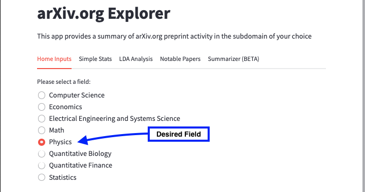
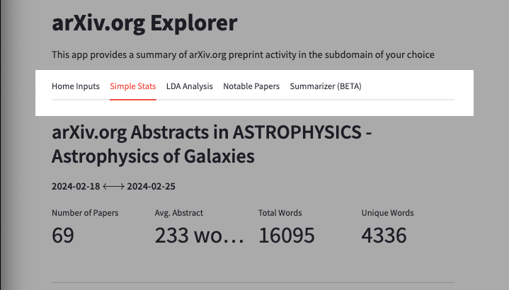
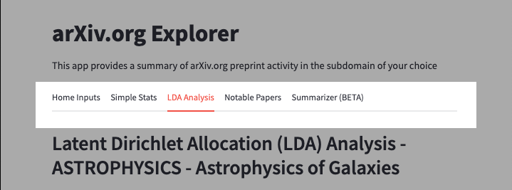
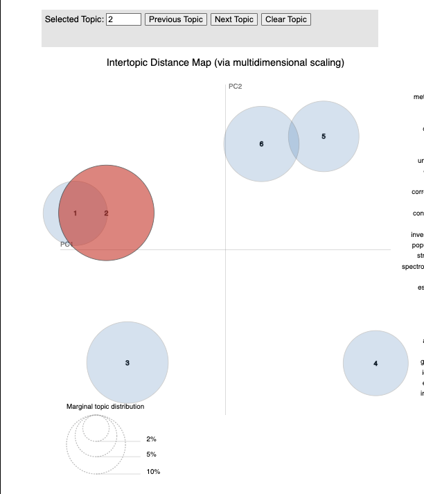
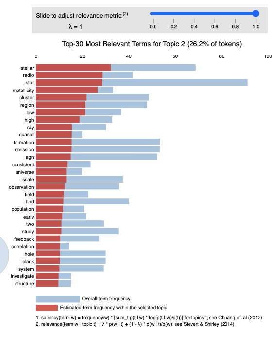
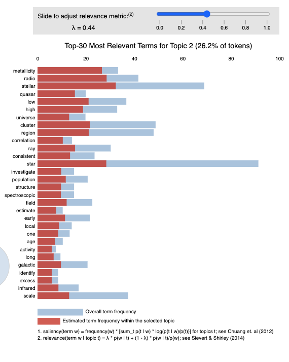
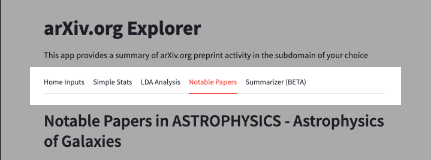
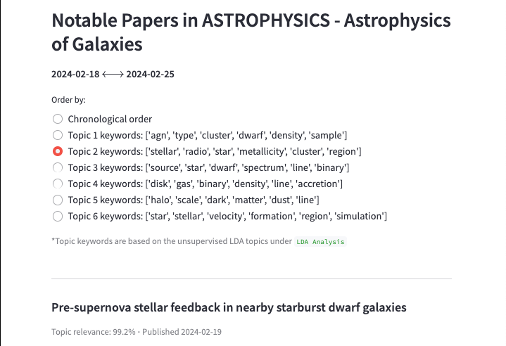

# ArXiv.org Explorer

## Overview

This app provides a summary of arXiv.org preprint activity in the subdomain of your choice through the arXiv API. arXiv provides 8 scientific fields with their respective sub-categories to choose from: 
- Computer Science
- Economics
- Electrical Engineering and Systems Science
- Math
- Physics
- Quantitative Biology
- Quantitative Finance
- Statistics

## Usage

### Setting the Input Parameters

1) Select the desired field.

2) Select a sub-category.

3) Choose the date window-size. 

    - Range can be set to 7, 30, or 90-day windows.
4) Choose the endpoint.

    - The endpoint determines the final window date.
    - If no end date is set, the current date will be used as the final window date. 
5) Click "Pull arXiv.org info" to get papers.


### Simple Statistics

After setting your input parameters, the 'Simple Stats' tab provides with summary statistics of the selected papers: 



- Number of papers selected 
    - Including visualization of submissions per date
- Average abstract length 
    - Including visualization of papers per token-length
- Total words
- Unique words 
- Word Cloud 
    - Visualization: graphical representation of word frequency

### LDA Analysis

Latent Dirichlet Allocation (LDA) is an unsupervised machine learning method to organize text documents by "topic" according to their vocabulary. Even narrow scientific fields will often span multiple overlapping topics, and using LDA models can help a researcher narrow the scope of papers relevant to their topic of interest.



We provide an Intertropic Distance Map that allows the user to interact with one of 6 selected topics. The topics are mapped from their original dimension into two-dimensions using principal component analysis (PCA), in which the circle-area is proportional to the number of words. 



Once a topic is selected, the distribution on the right-hand side displays the top-30 most salient terms for the selected topic. By default, the relevance metric ($\lambda$) is set to 1. 



Additionally, by sliding the relevance metric towards 0, rarer but more exclusive terms for the selected topic are highlighted. 



### Notable Papers

Notable Papers provides the user with the top 20 papers based on topic relevance from the LDA analysis performed in the previous tab. By default, the papers are sorted in chronological order, though the user also has the option of sorted by topic. Each paper is provided with an abstract (or summary) and link to the full text. 





### Summarizer (BETA)

Though a current work-in-progress, our summarizer allows a user to provide any link to an arXiv paper or PDF of choice for summarization. We provide summaries using the philschmid/bart-large-cnn-samsum BART model. 

[BART](https://arxiv.org/abs/1910.13461) is denoising autoencoder for pretraining sequence-to-sequence models. BART is trained by corrupting text with an arbitrary noising function, and learning a model to reconstruct the original text. It uses a standard Tranformer-based neural machine translation architecture, which can be seen as generalizing BERT, GPT, and many other more recent pretraining schemes (Lewis, et al., 2019). 

#### References

Lewis, Mike, et al. "BART: Denoising Sequence-to-Sequence Pre-training for Natural Language Generation, Translation, and Comprehension." ArXiv, 2019, https://doi.org/1910.13461. Accessed 25 Feb. 2024.

## Development
### Installation
#### Pipenv

For development, verify [Pipenv](https://pipenv.pypa.io/en/latest/) setup.

If Pipenv is not yet installed, please see [Pipenv Installation](https://pipenv.pypa.io/en/latest/installation.html#installing-packages-for-your-project). If using Windows, also see [Pipenv Windows Installation](https://www.pythontutorial.net/python-basics/install-pipenv-windows/)

1) Install the packages

``` pipenv install ```

2) Activate the virtual environment

``` pipenv shell ```

3) Open notebook

``` jupyter lab ```

3) Exit the virtual environment

``` exit ```
